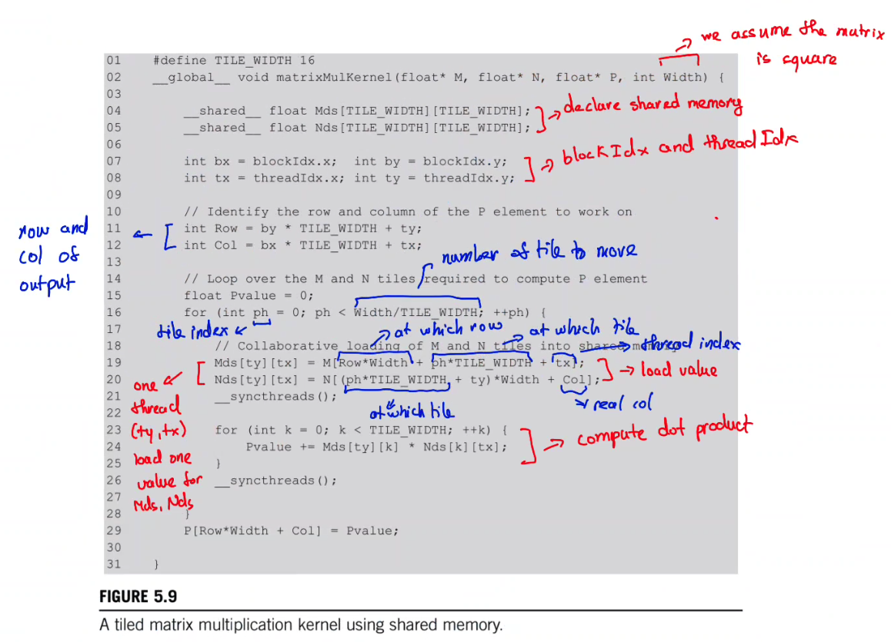
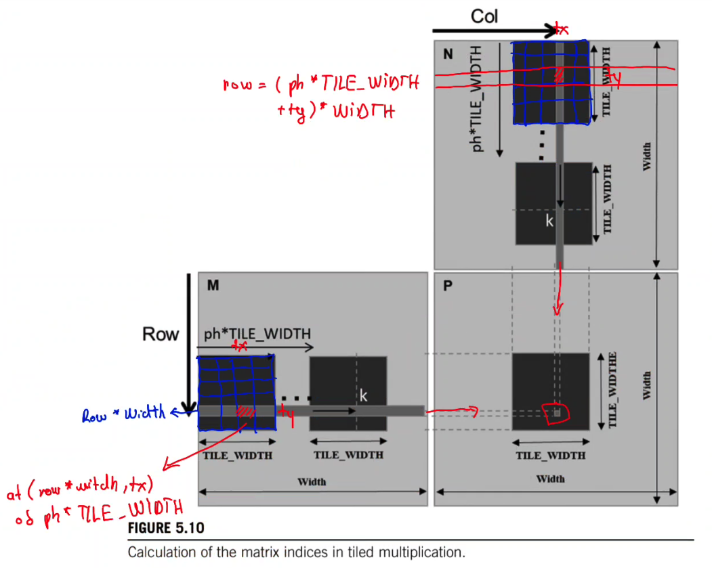

# Matmul kernel in PMPP style

PMPP usually writes tiled GEMM with **full global indices**. Simon [^simon] or gau-nernst [^gau-nernst] often **shifts the base pointers first, then uses shorter local indices**. 

Assume:
- $A$ has shape $M \times K$;
- $B$ has shape $K \times N$;
- $C$ has shape $M \times N$;
- matrices are row-major;
- `BLOCKSIZE = B`;
- `cRow = blockIdx.y`;
- `cCol = blockIdx.x`;
- `threadRow = threadIdx.y`;
- `threadCol = threadIdx.x`.

Simon style first moves the pointers to the block's starting tile:

```cpp
A += cRow * BLOCKSIZE * K;
B += cCol * BLOCKSIZE;
C += cRow * BLOCKSIZE * N + cCol * BLOCKSIZE;
```

After that, the local index `A[0]`, `B[0]`, or `C[0]` already refers to the block's starting position in the original global matrix:

```text
local A[0, 0] == global A[cRow * B, 0]
local B[0, 0] == global B[0, cCol * B]
local C[0, 0] == global C[cRow * B, cCol * B]
```

Then each phase over the $K$ dimension loads:

```cpp
As[threadRow * BLOCKSIZE + threadCol] = A[threadRow * K + threadCol];
Bs[threadRow * BLOCKSIZE + threadCol] = B[threadRow * N + threadCol];
```

This is equivalent to the PMPP-style full indexing:

```cpp
As[threadRow][threadCol] =
    A_global[(cRow * B + threadRow) * K + (phase * B + threadCol)];

Bs[threadRow][threadCol] =
    B_global[(phase * B + threadRow) * N + (cCol * B + threadCol)];
```

The pointer advance:

```cpp
A += BLOCKSIZE;
B += BLOCKSIZE * N;
```

is equivalent to increasing `phase` by one:

```text
A moves right by B columns
B moves down by B rows
```

So the two styles differ only in where the offset is written:

| Meaning | PMPP style | Simon/gau-nernst style |
| --- | --- | --- |
| Block row of $C$ | `blockIdx.y` appears in every full index | move `A` and `C` base pointers once |
| Block column of $C$ | `blockIdx.x` appears in every full index | move `B` and `C` base pointers once |
| Current $K$ tile | `phase * B` appears in every load | advance `A` and `B` pointers each loop |

## PMPP tiled kernel indexing





[^simon]: https://siboehm.com/articles/22/CUDA-MMM
[^gau-nernst]: https://github.com/gau-nernst/learn-cuda/blob/main/02a_matmul_simt/matmul.cu
